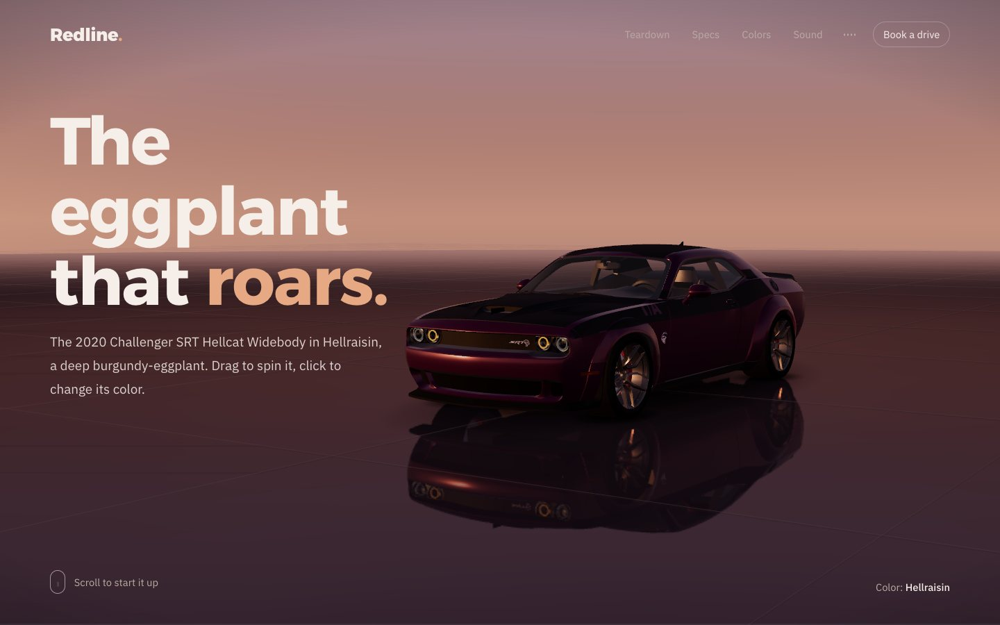
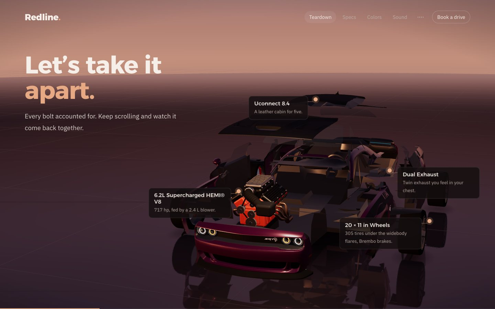
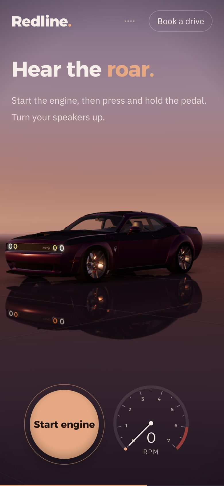

# Redline.

A scroll-driven 3D showcase for the 2020 Dodge Challenger SRT Hellcat Widebody in Hellraisin, built with three.js and Web Audio. It is one HTML file with no framework and no build step.

**Live demo: [challenger3d.vercel.app](https://challenger3d.vercel.app)**. Turn your sound on, then scroll.



## What it does

- **Hero.** Drag the car around, and click it (or tap it on a phone) to cycle the paint.
- **Teardown.** Every panel flies off along its own axis on its own beat, and the supercharged HEMI climbs out of the bay. It all comes back together as you keep scrolling.
- **Specs and color studio.** Animated numbers, then a 360° turntable with the real paint names.
- **Sound.** Start the engine, then press and hold the pedal to rev it into a burnout with smoke, squeal and a squirming tail. The engine is a Web Audio synth: no samples.
- **Drive-off.** The rear tyres light up, the car launches, and the camera chases it into the haze.
- **Scroll.** Wheel, keys and links glide on a critically damped spring. Every move eases in and eases out, and the copy and the car read the same position each frame. While you scroll it ticks softly, like winding a watch crown, and goes quiet where the engine takes over. Browsers only allow sound after a click, so the page opens on an Enter with sound / Enter muted screen. One toggle in the nav mutes everything.
- **Phones.** The copy sits on top, the whole car is framed below it, and the controls are at the bottom. Tap replaces hover.



## Run it

The 3D model is **not** in this repo, because its license doesn't allow redistributing the file. Get your own copy:

1. Download [Dodge Challenger SRT Hellcat Widebody](https://sketchfab.com/3d-models/dodge-challenger-srt-hellcat-widebody-f5f86380ecf049da8aa73ca969555e0f) by RPMRender from Sketchfab. You need a Sketchfab account. Choose the glTF / GLB download.
2. Build the web-ready file:

   ```bash
   cd tools
   npm install
   node build-model.mjs ~/Downloads/dodge_challenger_srt_hellcat_widebody.glb ../assets/hellcat.min.glb
   ```

3. Serve the folder and open it:

   ```bash
   cd ..
   python3 -m http.server 5178
   # http://localhost:5178
   ```



## Build one for another car

This repo ships an agent skill: [`.github/skills/car-showcase`](.github/skills/car-showcase/SKILL.md). It walks a coding agent through rebuilding this page for any car:

1. find a model you are allowed to use
2. clean and compress it
3. map its materials
4. find the wheels
5. split the body into panels
6. measure the lamps and creases
7. retune the copy, the camera and the engine sound
8. verify on desktop and phone

To use it:

- **GitHub Copilot**: open this repo and ask for “the car showcase for a 2023 Mustang GT” (or any car). Copilot picks up skills from `.github/skills`.
- **Every repo on your machine**: copy the folder into `~/.copilot/skills/`.

Two helpers live in `tools/`:

- `build-model.mjs`: one step from a downloaded GLB to the compressed file the page loads.
- `inspect-model.mjs`: lists a model's materials, sizes and positions in car space, with a first guess at each material's role.

## Credits

- **3D model**: [Dodge Challenger SRT Hellcat Widebody](https://sketchfab.com/3d-models/dodge-challenger-srt-hellcat-widebody-f5f86380ecf049da8aa73ca969555e0f) by RPMRender, [Sketchfab Standard license](https://sketchfab.com/licenses). The page repaints it and splits it into panels. The model file is not included here.
- **Built in code**: the HEMI in the teardown, the T/A livery, the halo rings, the engine sound and the scroll ticks.
- **Libraries**: [three.js](https://threejs.org) and [glTF Transform](https://gltf-transform.dev) with [meshoptimizer](https://github.com/zeux/meshoptimizer), all MIT.
- **Type**: [Alexandria](https://fonts.google.com/specimen/Alexandria) and [IBM Plex Sans](https://fonts.google.com/specimen/IBM+Plex+Sans), SIL Open Font License.

## License

The code is MIT licensed (see [LICENSE](LICENSE)). The license does not cover the 3D model, which is the property of its author and subject to its own license.

Dodge, Challenger, Hellcat, T/A and HEMI are trademarks of their respective owners. This is a personal demo, not affiliated with or endorsed by them.
